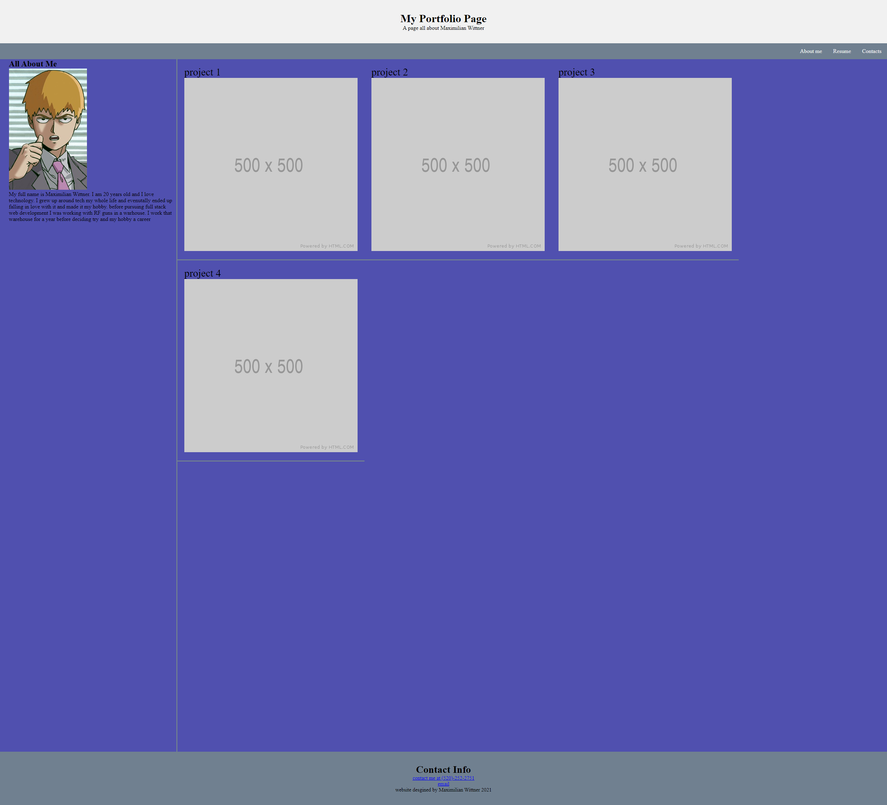

# Things I did to my portfolio
*made a proper working header with a lower bar that can be clicked and hovered for the items listed. "contacts" leads to the bottom of the pages with working links for contacts. 
*added an about me section with a placeholder pciture and a short paragraph about me
*I made some items change color on hover and also change color on click
*I made contact info fully work (can call and email me just by clicking each)
*added 4 placholder images with placholder text for projects that can be clicked and lead to my github account
---

---

